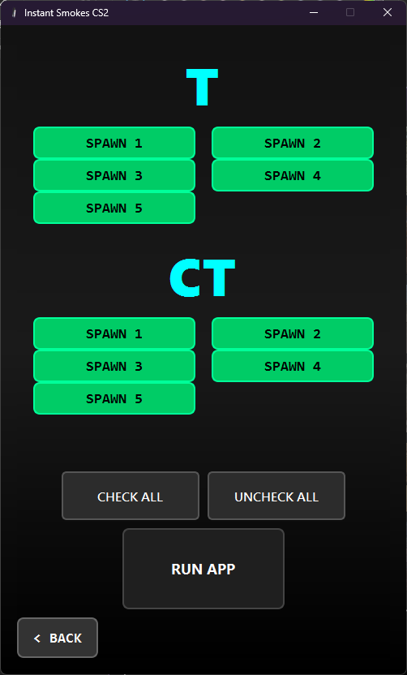
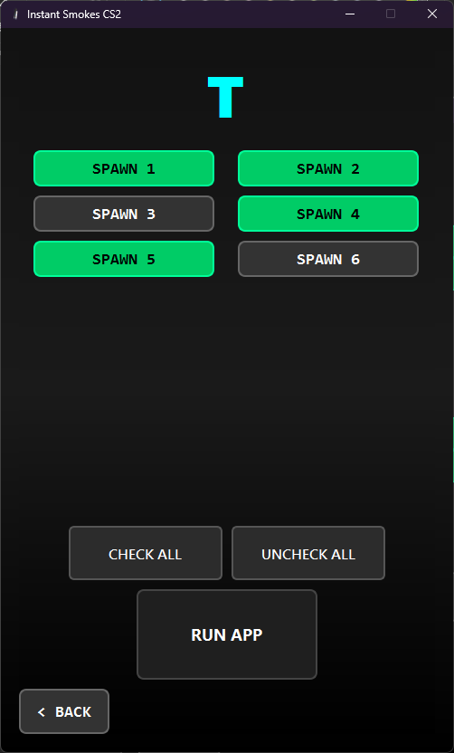
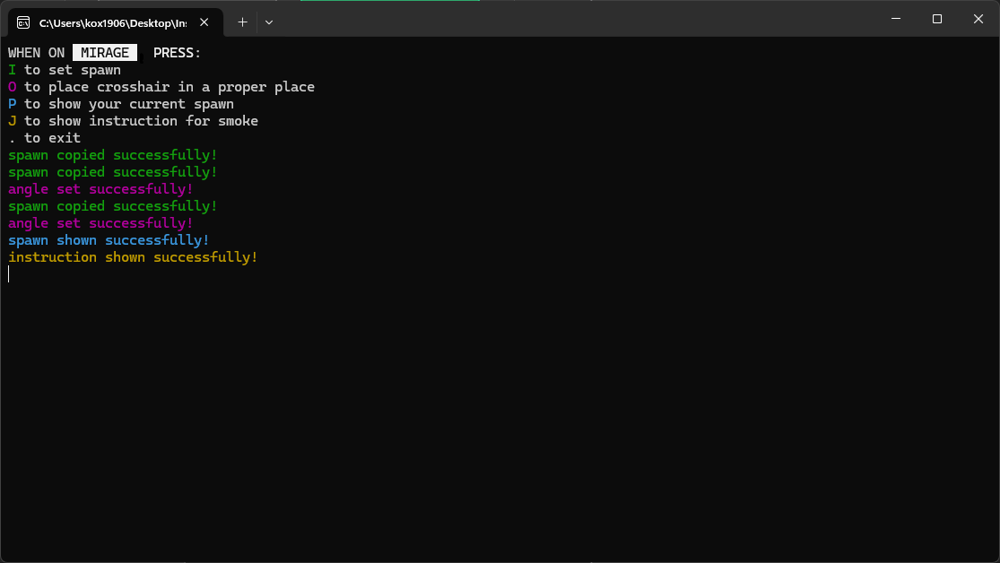
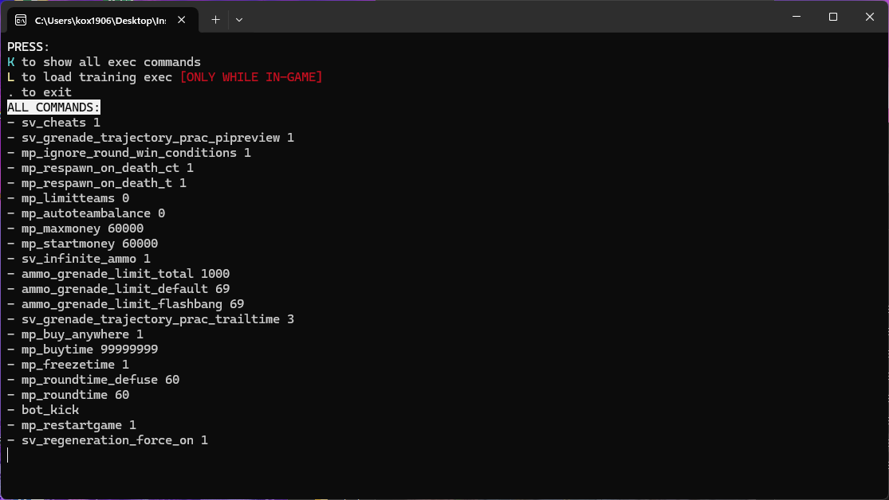

# Instant Smokes CS2

🚀 A utility app for training smokes in CS2 with spawn presets, view angles, and auto-exec loader.  
Made with Python + PyQt6. Works fully offline. Doesn't connect with CS files -> No CS2 cheats, VAC safe.

---

## 🎯 Features
- Choose map and spawns
- Auto-copy `setpos` + `setang` to clipboard
- Show instruction text in CS2 chat
- Load your own exec config in-game (exec.txt - you can modify with the commands you want)
- Fully configurable hotkeys via `config.json`
- Works as `.exe` – no Python required

---

## 🖱 How to Use
1. **Launch `launcher.exe`**
2. Choose a map → select spawns
3. Click `RUN APP`
4. In CS2, press keys:
   - `I` – copy spawn (`setpos`)
   - `O` – aim at correct spot (`setang`)
   - `P` – show spawn number
   - `J` – show instruction
   - `.` – exit the app

Optional:
- Press `load exec` on main screen to load exec commands (`exec.txt`)

---

## ⚙️ Configuration

You can edit hotkeys in `config.json`. Example:

```json
{
  "SETPOS_KEY": "I",
  "SETANG_KEY": "O",
  "SHOWPOS_KEY": "P",
  "INSTRUCTION_KEY": "J",
  "EXIT_KEY": ".",
  "EXEC_KEY": "L",
  "SHOW_COMMANDS_KEY": "K",
  "EC_SLEEP_TIME": 0.06
}
```

## 🧠 How It Works

- Launcher (PyQt6 GUI) lets you choose maps and spawn positions
- When you click `RUN APP`, the app launches a second script (`key_listener`) that:
  - Listens for hotkeys
  - Copies `setpos` / `setang` to clipboard
  - Writes them to CS2 console using simulated keypresses
- Works entirely offline. VAC-safe. No memory editing.
- Everything runs from a local `.exe` – no Python required.

## 🖼️ Screenshots

### 1. Map Selection


### 2. Spawn Selection




### 3. Key Listener (in console)

maps


load exec



## 🎥 Watch the demo ↓↓↓
[](https://www.youtube.com/watch?v=QbdQYqrDTww)

## 👀 About Spawns

Most of spawns are numerated properly to their actual states. Despite this, on a few maps I didn't take all of the spawns.
Numbers of spawns there may be different. For example on dust2 there is 7 spawns. In fact dust2 has around 15 spawns,
but most of them aren't instant or are useless, that's why I discounted them. 1-3 spawns are proper, then 4-7 are like 11-14 etc.

## ❓ FAQ

### ❓ "Will I get VAC banned?"
No. It does not inject or modify memory. It only simulates keypresses like a macro.

### ❓ "Can I change hotkeys?"
Yes. Edit the `config.json` file.

### ❓ "Can I change/add exec commands?"
Yes. Edit the `exec.txt` file

### ❓ "The .exe doesn't launch / show console"
❗Make sure faceit AC or any other Anti-Cheat doesn't work in the background❗
(won't ban you, but can block popping console windows)

Try running as Administrator

Make sure antivirus didn't block it 

### ❓ "Nothing happens when I press keys"
Check that CS2 console is open (`~` key). And make sure you've selected spawns first.

## 🧪 Tested On

- Windows 10 / 11
- CS2 (April 2025 update)
- Works with fullscreen + borderless mode

## 🧩 Download

> 👉 [Download .zip version (.exe file)](https://github.com/kox1906/instant-smokes-cs2/releases/download/v1.0.0/instant_smokes_cs2.zip)  

Unpack and launch `launcher.exe`. No installation needed.

## 🤝 Credits

Made by [kox1906](https://github.com/kox1906)  

## 📝 License

MIT – free to use and modify. Credit appreciated!


